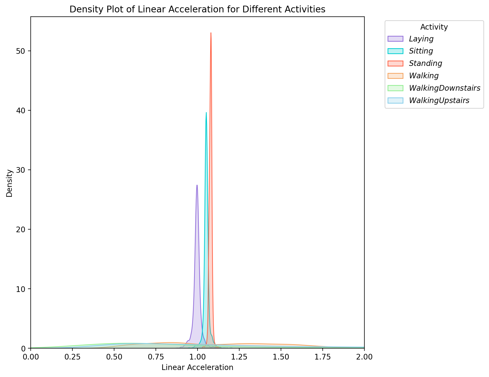

# Assignment 1

## Task 1 : Exploratory Data Analysis (EDA)

1. **Plot of One Sample Data from Each Class**

    

    It can be infered from the graphs that the amplitudes of acceleration of static activities (Laying, Standing, Sitting) is much smaller than that of the dynamic activities (Walking, Walking Upstairs, Walking Downstairs).

    The model can well differentiate / classify activities as static and dynamic only. But because of less complexity of the model, it can't differentiate the 6 activities much accurately. Since the data is time-sensored data, use of Neural Network Algorithms will be able to classify each activity.

2. **Density Plot of Linear Acceleration for Different Activities**

    

    ### STATIC ACTIVITIES
      * The narrow acceleration range classifies static activities like laying, standing and sitting, as the waveform also   shows a near flatline for such activities. The concentrated density signifies minimal variation in acceleration, reflecting the relatively stationary nature of these activities.
    
    ### DYNAMIC ACTIVITIES
      * The broad acceleration range classifies dynamic activities like walking, walking downstairs and walking upstairs, as the waveform also shows a high change in acceleration for such activities. The reduced prominence of density peaks implies a greater variability in acceleration values, which is indicative of movement and changes in activity.
    
    Based on the linear acceleration properties of the activities, this plot helps in the distinction between static and dynamic activities. It is feasible to determine whether an activity is largely stationary or involves movement by examining the density peaks and the acceleration value distribution. With the help of this data, models that can categorize activities according to their patterns of acceleration will be developed, which would benefit applications like activity recognition and health monitoring.

3. **Visualizing the data using PCA**

      * Scatter Plot to visualize different classes of activities (PCA on Total Acceleration)

        

      * Scatter Plot to visualize different classes of activities (PCA on features created by using TSFEL)

        
      
      * Scatter Plot to visualize different classes of activities (PCA on features in the provided dataset)

        


## Task 2 : Decision Trees for Human Activity Recognition

1. **Use of Sklearn Library to Train Decision Trees**

    * **Results for decision tree model trained using the raw accelerometer data:**

      The code for training a decision tree model using the raw accelerometer data - ['sec1.ipynb'](Task_2/sec1.ipynb)
    
        - Accuracy: 0.61
        - Precision: 0.60
        - Recall: 0.61
        
        - Confusion Matrix:
          ```
          [[34368     0     0     0     0     0]
           [    0 23461  5141   385   896  1541]
           [    0  5893 23824   483     0  3848]
           [   16  2301  2800 13051  3369 10207]
           [   23  1527  1698  9328  4788  9516]
           [   26  1241  2575  9532  1752 15018]]
          ```

        Here, from the confusion matrix, we can observe that the model predicts correctly for class 1. However, it isn't very accurate when it comes to the rest of the classes. To mitigate this inconsistency, we tried oversampling the minority class by applying SMOTE (Synthetic Minority Over-Sampling Technique). This implementation yields the following results:
    
    * **Results after applying SMOTE:**
    
        - Accuracy: 0.62
        - Precision: 0.62
        - Recall: 0.62
        
        - Confusion Matrix:
          ```
          [[34368     0     0     0     0     0]
           [    0 25329  4001   548     0  1546]
           [    0  6748 23028   410     0  3862]
           [   16  4143  2579 10958  6374  7674]
           [   23  3434  1549  5784 10525  5565]
           [   26  2989  2365  8063  3431 13270]]
          ```
    
        To improve the results even further, we tried undersampling the majority and the results were as follows:
    
    * **Results after applying Undersampling:**
    
        - Accuracy: 0.63
        - Precision: 0.62
        - Recall: 0.63
        
        - Confusion Matrix:
          ```
          [[34368     0     0     0     0     0]
           [    0 25323  4011   441   103  1546]
           [    0  6666 23064   351   110  3857]
           [   16  2987  2611 10912  7508  7710]
           [   23  2338  1558  5768 11566  5627]
           [   26  1430  2379  8024  4952 13333]]
          ```

        Thus, it can be observed that even after implementing oversampling and undersampling, significant changes in the result are not observed. Yet, undersampling provides slightly better results compared to oversampling.

    * **Results for decision tree model trained using the features obtained by TSFEL:**

      The code for training a decision tree model using the features obtained by TSFEL - ['sec2.ipynb'](Task_2/sec2.ipynb)
    
        - Accuracy: 0.89
        - Precision: 0.90
        - Recall: 0.89
        
        - Confusion Matrix:
          ```
          [[9 0 0 0 0 0]
           [1 7 1 0 0 0]
           [1 1 7 0 0 0]
           [0 0 0 7 2 0]
           [0 0 0 0 9 0]
           [0 0 0 0 0 9]]
          ```
        
        Oversampling and undersampling yielded the same results for the decision tree model trained with this data.
    
    * **Results for decision tree model trained using the features provided in the dataset:**

      The code for training a decision tree model using the features provided in the database - ['sec3.ipynb'](Task_2/sec3.ipynb)
    
        - Accuracy: 0.84
        - Precision: 0.84
        - Recall: 0.84
        
        - Confusion Matrix:
          ```
          [[537   0   0   0   0   0]
           [  0 400  91   0   0   0]
           [  0 107 425   0   0   0]
           [  0   0   0 462  18  16]
           [  0   0   0  31 276 113]
           [  0   0   0  51  35 385]]
          ```

        Oversampling and undersampling yielded the same results for the decision tree model trained with this data.

    * **Comparison Between the 3 Models**

        The model trained on raw accelerometer data shows poor performance across all metrics compared to the other two models. The model trained on the features provided in the dataset shows better performance than the raw data model. However, the model trained on the TSFEL features shows the best performance with an accuracy of 89% and precision of 90%. From the confusion matrix, we observe that it works well for most of the classes. The reason for better performance is that TSFEL extracts relevant features, making it easier for the model to distinguish between the classes/activities.

2. **Train Decision Trees with Varying Depths (2-8) Using All the Above 3 Methods**
    
    ### Plot of accuracy vs depth of the trees for the models

    - Model trained on Raw Accelerometer Data 

    

    - Model trained using features extracted from TSFEL

    

    - Model trained on features provided in the dataset

    

3. **Bad Activities and Participants**

    Upon analyzing the confusion matrices for model 1, model 2 and model 3, we notice that all the models fit perfectly for class 1, and model 3 fits perfectly for class 1, class 5 and class 6. Furthermore, it can be also observed that Model 1 has the most
    misclassifications followed by model 3 and model 2 respectively. The reason for this miscalculations is class imbalance. We tried to resolve the class imbalance by trying to oversample the minority classes and undersample the majority classes, however it did not make much difference to the accuracy values, precision values and confusion matrices. 

    We can also determine the best and worst performing activities/classes by F1 score measure. 


## Task 3 : Prompt Engineering for Large Language Models (LLMs)

## Task 4 : Data Collection in the Wild

1. **Result of Decision Tree Model model trained on the raw accelerometer data on our data is as follows**

    Accuracy: 0.24
    Precision: 0.19
    Recall: 0.24
    Confusion Matrix:
      [[5162    0    0    0    0    0]
      [5738   13    2    2   77  113]
      [4705   22    0    0   21   47]
      [3246  104    3 2270  109  228]
      [3067  112    1 1602   75  163]
      [2984  132    2 1847   71  194]]
    
    Here we observe that the accuracy is very low and from the confusion matrix we can observe that the data shows high imbalance. The model works well for the class 1 whereas it isn't able to predict other activities efficiently. To improve on the accuracy we can try to preprocess the data.

2. **Result of Decision Tree Model model trained on the raw accelerometer data on our data after preprocessing is as follows**

    Accuracy: 0.24
    Precision: 0.19
    Recall: 0.24
    Confusion Matrix:
      [[5162    0    0    0    0    0]
      [5738   13    2    2   77  113]
      [4705   22    0    0   21   47]
      [3246  104    3 2270  109  228]
      [3067  112    1 1602   75  163]
      [2984  132    2 1847   71  194]]
    
    Even after normalization the metrics still remains the same and from the confusion matrix we can observe that the model still does not predict accurately and has very low accuracy with high imbalance.

    After featurising 

    Accuracy: 0.58
    Precision: 0.59
    Recall: 0.58
    Confusion Matrix:
      [[724 173 121   1   0   1]
      [170 742 227   6  13  13]
      [ 80 172 680   6   8  12]
      [  0  10   9 656 241 269]
      [  0   8  15 233 477 282]
      [  0  17  12 279 290 476]]

    After featurising we observe a significant increase in the accuracy and precision. From the confusion matrix, we can observe that the model doesn't accurately predict for any of the classes, however the accuracy has increased as compared to the previous results. 


    

## Decision Tree Implementation
